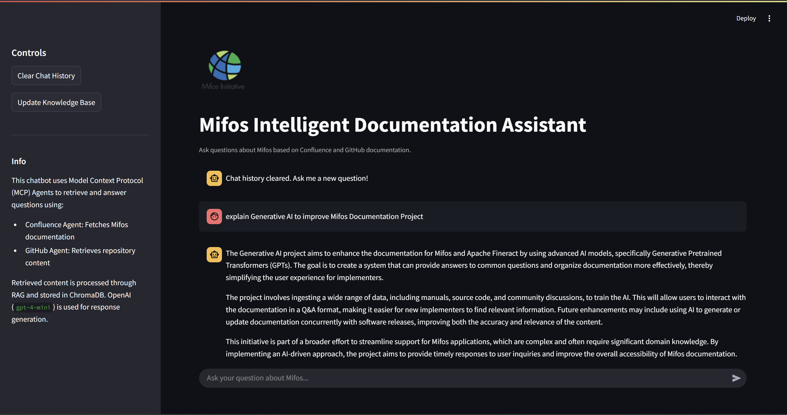

# Mifos Chatbot

An intelligent chatbot powered by MCP, LangChain, OpenAI Agent SDK and GPT-4o-mini that provides information about Mifos Initiative Applications by searching through Confluence documentation and GitHub repositories.

Link to the demo: [Mifos Chatbot Demo](https://youtu.be/R1zelDSoTMs)



## Features

-   🔍 **Smart Documentation Search**: Intelligently searches through Mifos Confluence documentation and GitHub repositories
-   🤖 **RAG-Enhanced Responses**: Uses Retrieval Augmented Generation (RAG) to provide accurate, contextual answers
-   💬 **Conversational Interface**: Natural dialogue-based interaction through a Streamlit web interface
-   📚 **Multiple Knowledge Sources**: Integrates content from both Confluence documentation and GitHub repositories
-   🎯 **Context-Aware**: Maintains conversation history for more relevant responses
-   📊 **Source Attribution**: Cites the source documents used to generate responses

## Setup

### Prerequisites

-   Python 3.10
-   OpenAI API key
-   GitHub Personal Access Token
-   Confluence API key
-   Git
-   uv

### Installation

1. Clone the repository:

```bash
git clone https://github.com/Nimsara2001/sample-mifos-chatbot.git
cd sample-mifos-chatbot
```

2. Create and activate a virtual environment using uv:

```bash
uv venv
# On Unix/macOS:
source .venv/bin/activate
# On Windows:
.venv\Scripts\activate
```

3. Install dependencies with uv:

```bash
uv sync
```

4. Set up environment variables:
   Create a `.env` file in the project root and add:

```
OPENAI_API_KEY=your_api_key_here
GITHUB_PERSONAL_ACCESS_TOKEN=your_github_token_here
CONFLUENCE_API_TOKEN=your_confluence_token_here
```

### Data Processing

1. Process the documentation data:

```bash
python main.py --reprocess
```

This will:

-   Initialize the ChromaDB vector store
-   Process Confluence documentation
-   Process GitHub README files
-   Create embeddings for efficient searching

2. Open your browser and navigate to `http://localhost:8501`

## Project Structure

-   `rag_controller.py`: Implements the RAG (Retrieval Augmented Generation) system
-   `data_processor.py`: Handles document processing and embedding creation
-   `streamlit_app.py`: Web interface implementation
-   `mifos_agents.py`: Custom agent implementations
-   `agent_controller.py`: Manages agent interactions
-   `execute_agent.py`: Executes agent commands
-   `main.py`: Main entry point for the application
